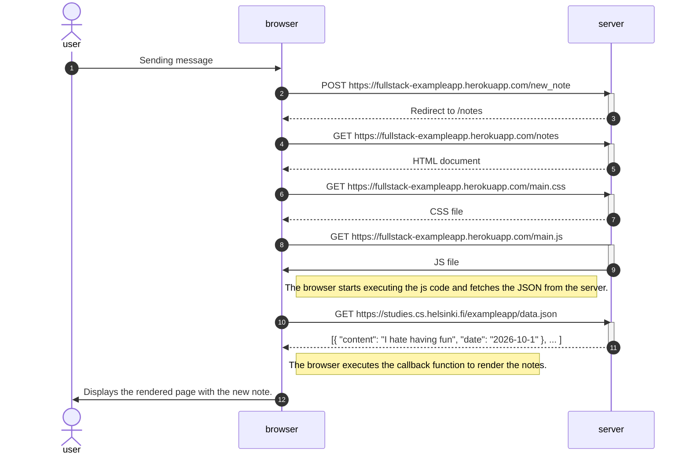

```mermaid
sequenceDiagram
    autonumber
    actor user
    participant browser
    participant server

    user->>browser: Sending message

    browser->>server: POST https://fullstack-exampleapp.herokuapp.com/new_note
    activate server
    server-->>browser: Redirect to /notes
    deactivate server

    browser->>server: GET https://fullstack-exampleapp.herokuapp.com/notes
    activate server
    server-->>browser: HTML document
    deactivate server

    browser->>server: GET https://fullstack-exampleapp.herokuapp.com/main.css
    activate server
    server-->>browser: CSS file
    deactivate server

    browser->server: GET https://fullstack-exampleapp.herokuapp.com/main.js
    activate server
    server->>browser: JS file
    deactivate server

    Note right of browser: The browser starts executing the js code and fetches the JSON from the server.

    browser->>server: GET https://studies.cs.helsinki.fi/exampleapp/data.json
    activate server
    server-->>browser: [{ "content": "I hate having fun", "date": "2026-10-1" }, ... ]
    deactivate server

    Note right of browser: The browser executes the callback function to render the notes.

    browser->>user: Displays the rendered page with the new note.
```