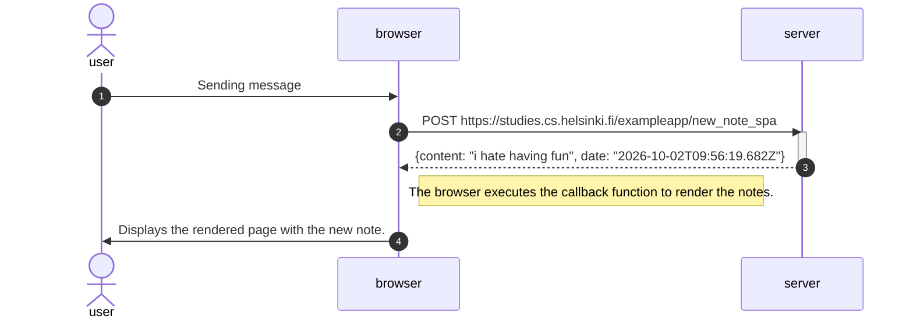

```mermaid
sequenceDiagram
    autonumber
    actor user
    participant browser
    participant server

    user->>browser: Sending message

    browser->>server: POST https://studies.cs.helsinki.fi/exampleapp/new_note_spa
    
    activate server
    server-->>browser: {content: "i hate having fun", date: "2026-10-02T09:56:19.682Z"}
    deactivate server

    Note right of browser: The browser executes the callback function to render the notes.

    browser->>user: Displays the rendered page with the new note.
```